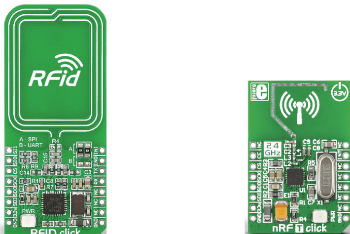

# PI : Projet intégré pour le cours de systèmes embarqués 2

## Objectifs

Ce projet intégré a pour objectif la mise en pratique des concepts étudiés
durant les cours de systèmes embarqués 1 et 2. Il permettra à chaque étudiant
de réaliser une application en C sur un système d'exploitation élémentaire
(coopératif) et de mettre en oeuvre divers périphériques d'entrée/sortie
et de communication.

A la fin du laboratoire, les étudiant-e-s seront capables de

* Synthétiser les notions acquises durant les cours
* Gérer de bout en bout un mini-projet informatique en groupe
* Analyser et clarifier l’énoncé d’un projet
* Elaborer et comparer diverses variantes de réalisation
* Concevoir des pilotes de périphériques simples et étudier leur datasheet
* Mettre en oeuvre un système d’exploitation élémentaire avec traitement d'interruptions
* Concevoir et développer une application modulaire en C sur un système embarqué

Durée du travail pratique

* 8 séances de laboratoire + travail personnel

Rapport à rendre

* un journal de laboratoire avec le code source sur le dépôt centralisé après chaque séance

## Travail à réaliser

Ce projet a pour but la réalisation d'une application ou d'un jeu sur la
cible utilisée durant les laboratoires de systèmes embarqués 1 et 2,
le Beaglebone Black, par groupe de 2 étudiants

Le choix de l'application ou du jeu est laissé à la libre créativité de chaque
groupe. Cependant, la mise en oeuvre de l'écran LCD OLED ainsi que d'une nouvelle
carte "Click Board" est obligatoire. Voici les nouvelles cartes ainsi que quelques
idées de réalisation :

* RFid click : un lecteur de badges RFID à 13.56 MHz 
  * Quiz : les réponses seront données à l'aide de badges RFID
  * ...

* nRF T click un système de communication à 2.4GHz
  * Jeu à distance (p. ex. touché/coulé, ...)
  * Thermomètre distant (une cible mesure la température, l'autre l'affiche)
  * ...


## Contraintes

Hormis l'utilisation des périphériques mentionnés ci-dessous, l'application devra

* mettre en oeuvre le système d'exploitation élémentaire coopératif
* mettre en oeuvre le système de traitement des interruptions
* structurer le logiciel en plusieurs tâches (threads)
* mettre en oeuvre un système de communication entre les tâches (p.ex. message queue)
* traiter les périphériques d'entrée/sortie en mode interruptif (GPIO)

## Pêchés capitaux

Chaque groupe se fera un point d'honneur à éviter les 7 pêchés capitaux suivants

1. L'Orgueil - livrer un programme sans vérification
2. l'Avarice - écrire un code monolithique
3. L'Envie - utiliser des nombres magiques
4. La Colère - laisser les warnings à la compilation
5. L'Inconsistance - mal indenter, choisir des noms inappropriés, etc.
6. La Paresse - écrire un code sans commentaire
7. La Gourmandise - copier du code sans citation

## Phases et rendus du projet

Le projet sera réalisé en 8 phases distinctes. A la fin de chaque phase,
un document (journal de travail ou spécification) ainsi que le code et les
tests réalisés devront être rendus via le dépôt centralisé.

* TP1 - 1ère séance de laboratoire
  * Tâches : Lancement du projet et spécification de l'application
  * Rendu : Document de spécification du projet

* TP2 - 2e séance de laboratoire
  * Tâches : Traitement des interruptions logicielles et des exceptions
  * Rendu : Journal de travail

* TP3 - 3e séance de laboratoire
  * Tâches : Traitement des interruptions matérielles
  * Rendu : Journal de travail

* TP4 - 4e séance de laboratoire
  * Tâches : Conception et design de l'application
  * Rendu : Document de conception

* TP5 - 5e séance de laboratoire
  * Tâches : 1ère phase de réalisation et validation de l'application
  * Rendu : Journal de travail

* TP6 - 6e séance de laboratoire
  * Tâches : 2e phase de réalisation et validation de l'application
  * Rendu : Journal de travail

* TP7 - 7e séance de laboratoire
  * Tâches : 3e phase de réalisation et validation de l'application
  * Rendu : Document de présentation

* TP8 - 8e séance de laboratoire
  * Tâches : Présentation du travail et de l'application et évaluation
  * Rendu : ---


## Evaluation

Le projet sera évalué selon les 4 critères suivants:

* Gestion du projet
  * Rassembler (les documents et infos nécessaires à la réalisation)
  * Gérer (commit régulier des sources sur le dépôt git avec des messages appropriés)
  * Rendre Compte (journal de travail)

* Qualités techniques
  * Analyser (étude des composants HW/SW)
  * Concevoir (architecture/design de l'application)
  * Réaliser (implémentation de l'application)
  * Assurer (validation et vérification régulière du code)

* Documenter (documentation du code et rédaction des rapports)

* Exposer (présentation finale)


## Mises à jour

* Pour mettre à jour la bibliothèque spécialisée du Beaglebone

    ```
    $ cd ~/workspace/se12/tp
    $ git pull upstream master
    $ make -C ~/workspace/se12/tp/bbb/source
    ```

* Pour mettre à jour les paths des includes dans eclipse
  * ouvrir _`Properties`_ de votre projet
  * aller   _`C/C++ General`_  --> _`Paths and Symbols`_
  * ouvrir _`Includes`_ --> _`GNU C`_
  * ajouter _`/home/lmi/workspace/se12/tp/bbb/source`_

## Conditions

* Rendu
  * Le code et les divers documents seront rendus au travers du dépôt Git centralisé
    * sources: _.../tp/pi_
    * rapport: _.../tp/pi/doc/report\_\<x\>.pdf_ (x représente le numéro du TP)

* Délai
  * Les documents et le code doivent être rendus au plus tard 7 jours après la fin de chaque TP à 23h59

## Click Board

* [RFid click](https://www.mikroe.com/rfid-click)
* [nRF T click](https://www.mikroe.com/nrf-t-click)



