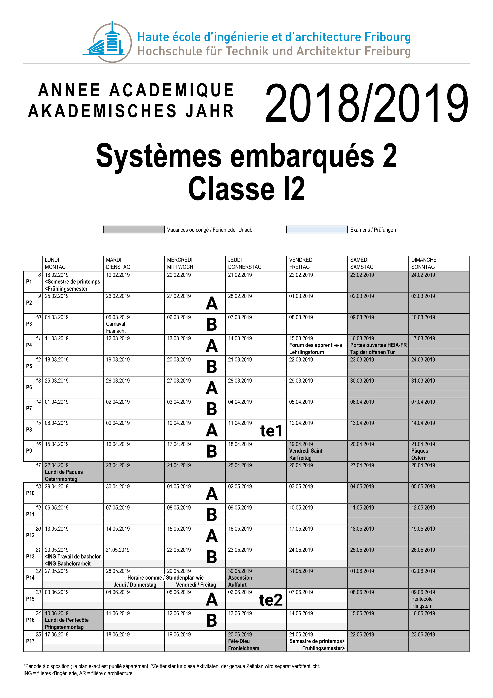

# Répartition des TPs pour la classe I2

## Groupe A

* Team A0 (RFID) : Loïc Amantini, Samuel Baula
* Team A1 (NRF24) : Mathieu Baechler, Vincent Brodard
* Team A2 (RFID) : Laurent Chassot, Tony Licata
* Team A3 (NRF24) : Emerald Cottet, Quentin Seydoux
* Team A4 (NRF24) : Loïc Domeniconi, Stefan Pahud
* Team A5 (NRF24) : Hindi Ollyn Vasco Golay, Mireille Favre-Bulle
* Team A6 (RFID) : Amanda Hayoz, Kevin Pantillon
* Team A7 (RFID) : Sten Kapferer, Rémi Zamofing
* Team A8 (NRF24) : Nicolas Maier, Jonathan Dias Vicente
* Team A9 (NRF24) : Martin Spoto, Victor Bernet

## Groupe B

* Team B0 (NRF24) : Adrian Buntschu, Julien Härle
* Team B1 (NRF24) : Guillaume Dévaud, Nicolas Crausaz
* Team B2 (RFID) : Loïc Freiburghaus, Yael Iseli
* Team B3 (NRF24) : Yannis Huber, Nicolas Feyer
* Team B4 (NRF24) : Florent Kilchoer, Luca De Laurentiis, Lea Corsi
* Team B5 (RFID) : Kevin Manixab, Luke Perrottet
* Team B6 (NRF24) : Nicolas Realini, Daniel D'Incà
* Team B7 (RFID) : Dorian Saudan, Uchendu Nwachukwu
* Team B8 (RFID) : Yulia Termkhitarova, Samoelina Hana Nantenaina Ranaivo

[Version PDF du calendrier](img/Calendrier_es2_I2_2018-2019.pdf)