# TP01 : Introduction

## Objectifs

A la fin du laboratoire, les étudiant-e-s seront capables de

* Décrire les processus de développement en micro-informatique
* Appliquer les règles de fonctionnement du travail en laboratoire
* Trouver le matériel et la documentation dans le laboratoire
* Décrire les processus d’assemblage et d’édition de liens d’une application compilée (ou assemblée)
* Manipuler et connecter correctement les cibles
* Manipuler les fonctions de base de l’environnement de développement
* Décrire les caractéristiques principales du microprocesseur
* Analyser le déroulement d’un programme élémentaire

Durée

* 1 séance de laboratoire (4 heures)

Rapport

 * Journal de laboratoire

## Beaglebone Black – Cible


## Beaglebone Black - Features

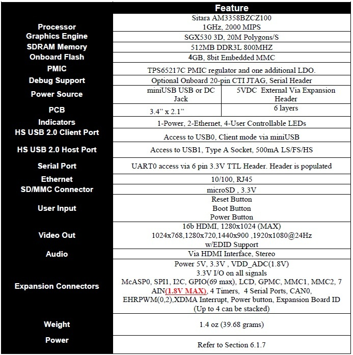

## ARM Cortex-A8 et ses registres internes

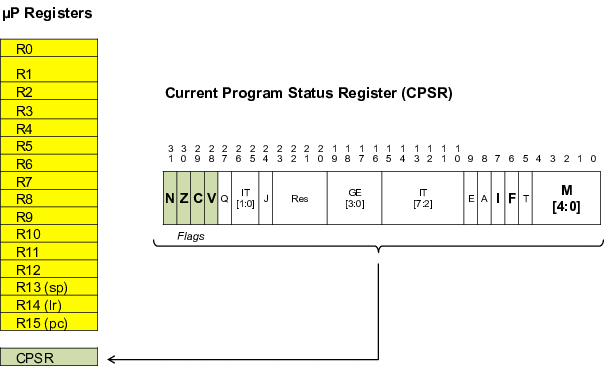


## Processus de développement logiciel

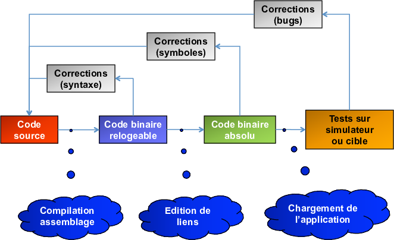

Le développement de logiciel suit les étapes suivantes

* Le code source assembleur, C ou autre est écrit dans des fichiers texte (ascii)
à l’aide d’un éditeur de texte.
* Le code source est ensuite compilé pour obtenir le code binaire « relogeable »
exécutable par le µP. Une phase de correction liée à l'écriture correcte du
code source (syntaxe) est naturellement comprise dans cette partie du processus.
* Le fichier binaire est lié à l'architecture matérielle. Cette étape se divise
en deux phases. La première consiste à résoudre les liens entre les différents
symboles (p.ex. appel de fonction, adresses de variables globales... Si
des symboles restent indéfinis, une phase de correction devra être entreprise.
La deuxième consiste à reloger le code selon l'organisation mémoire de la cible.
En fonction des systèmes d’exploitation et des environnements de développement,
cette phase peut intervenir lors du chargement du code sur la cible.
* Le code est chargé en mémoire sur le système cible (système
de test ou simulateur). Il est ensuite testé de manière
exhaustive. Une série de corrections liées au mauvais
fonctionnement du programme (bugs) peuvent intervenir à cette étape.

> **Attention:**
> 
> Des erreurs dues à une mauvaise conception (design) de l'application qui
> apparaissent lors de sa vérification peuvent être très complexes à identifier
> et coûter beaucoup d'énergie et d'argent pour être corrigées!

## Processus d’implémentation du logiciel

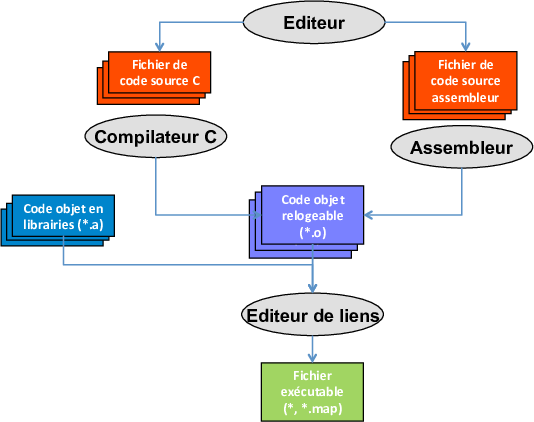


## Développement de logiciel pour systèmes embarqués

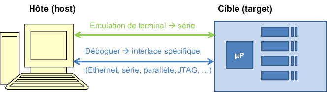

**Sur l'hôte**

* Développement de l’application
    * Edition code source
    * Compilation / Assemblage
    * Edition de liens (linking)
* Débogueur
    * Code source
    * Symboles / adresses
* Terminal (optionnel)
    * Commandes
    * Tracing / logging

**Sur la cible**

* Exécution de l’application
    * Code binaire
* Serveur de débogage
    * Agent (i/f avec débogueur)

## Développement avec le Beaglebone Black

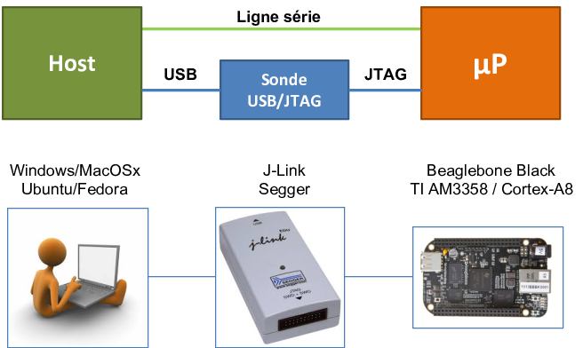

## Vue détaillée de la chaîne d’outils de développement

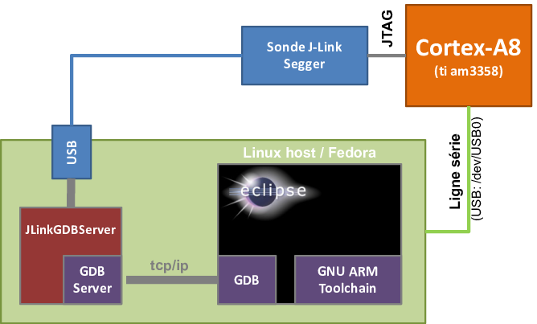

## Outils de développement (IDE)

Pour le développement,nous n’utiliserons principalement des outils libres sous Windows 10,
Mac OS X 10.13.6, Fedora 28 ou Ubuntu 18.04

* Eclipse C/C++ 4.8 (Photon), utilitaire de gestion de projet de développement
informatique (IDE – Integrated Development Environment)
* GNU-toolchain, outils de développement d’applications, avec
    * Les binutils (assembler, linker, ...) version 2.30
    * Le compilateur C version 7.3.1
    * Le débogueur GDB version 8.1.0
    * Le make version 4.2.1
    * La librairie standard newlib 3.0 de RedHat
* Git pour la gestion de tout le code source
* J-Link Software V6.34f, utilitaire permettant d’interfacer la chaine d’outil GNU avec
la cible au travers d’une interface USB/JTAG
* Une configuration de projet spécifique HEIA-FR pour notre cible

## Organisation de l’espace de travail et des dépôts Git

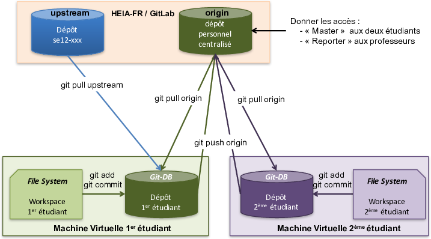

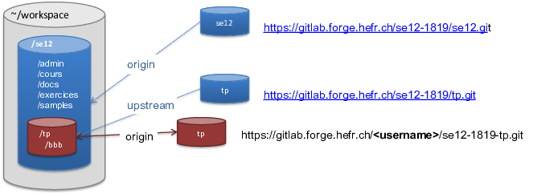

## Installation de l’environnement de développement

Chaque étudiant peut choisir entre 2 options

* Option 1
    * Travailler avec une machine virtuelle VirtualBox sur sa propre machine
* Option 2
    * Travailler avec sa machine personnelle sous Windows / Mac OS X / Linux

Installation de la machine

* L’option 1 est favorisée, car elle offre une plus grande flexibilité
* Pour l'option 2, suivre les instructions des slides Backups

Nommage de l’espace de travail

* Option 1: `/home/lmi/workspace/se12`
* Option 2: `$(home)/workspace/se12`

## Option 1: Installation sur machine virtuelle VirtualBox

* Copier de la clef USB l'hyperviseur VirtualBox sur la machine personnelle
    * VirtualBox-5.2.18-124319-OSX.dmg pour Mac OS X
    * VirtualBox-5.2.18-124319-Win.exe pour Windows
* Installer l'hyperviseur avec son paquet d'extension sur la machine personnelle
* Copier le fichier "lmi-se12.ova" contenant la machine virtuelle sur
la machine personnelle (Fedora ou Ubuntu)
* Lancer la machine virtuelle
* Effacer le fichier "lmi-se12.ova" (optionnel)

## Création et installation de l’environnement

Créer le dépôt de groupe pour les tp (1 par groupe de 2 personnes)

*  Avec un browser aller sur le Git de l’école (https://gitlab.forge.hefr.ch/)
* Sélectionner l’onglet « Projects » et cliquer « + New Project »
* Nomer le projet « se12-1819-tp » et cliquer « Create project »
* Noter l’URL du projet (https://gitlab.forge.hefr.ch/<username>/se12-1819-tp)
* Ajouter le professeur comme « Reporter » (au minimum) au projet
(https://gitlab.forge.hefr.ch/<username>/se12-tp/project_members)

Ouvrir l’espace de travail (workspace)

* Ouvrir un terminal (une shell Linux) et entrer dans le workspace
* `$ cd ~/workspace/se12/tp`

Configurer Git

* `$ git config --global user.name "<User Name>"`
* `$ git config --global user.email user.name@edu.hefr.ch`

Mettre à jour le dépôt local

  * `$ git pull upstream master`

Ajouter les « tp » sur le dépôt local et synchroniser avec le dépôt de groupe

* `$ git remote add -t master -m master origin https://gitlab.forge.hefr.ch/<username>/se12-1819-tp.git`
* `$ git branch -u origin/master`
* `$ git push origin master`

## Démarrage de l’IDE

* A partir de votre station de travail Linux, démarrer l’IDE« Eclipse ».
* Placer le workspace sur le répertoire
    * `/home/lmi/workspace`

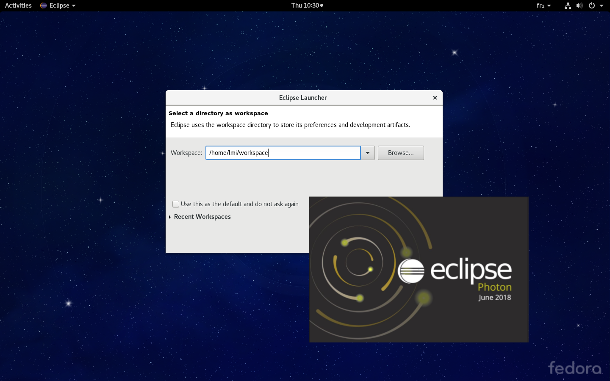

## Création d’un nouveau projet

* Aller dans le *« Project Explorer »*, cliquer le button droit de
la souris et choisir *« New &rarr; C Project »*
* Sélectionner la location du projet *« <.../se12/tp/tp.01>*
* Donner un nom *« tp.01 »*
* Choisir **« Makefile Project &rarr; Empty Project &rarr; Cross ARM GCC »**
* Cliquer *« Next » &rarr; « Next » &rarr; « Finish »*

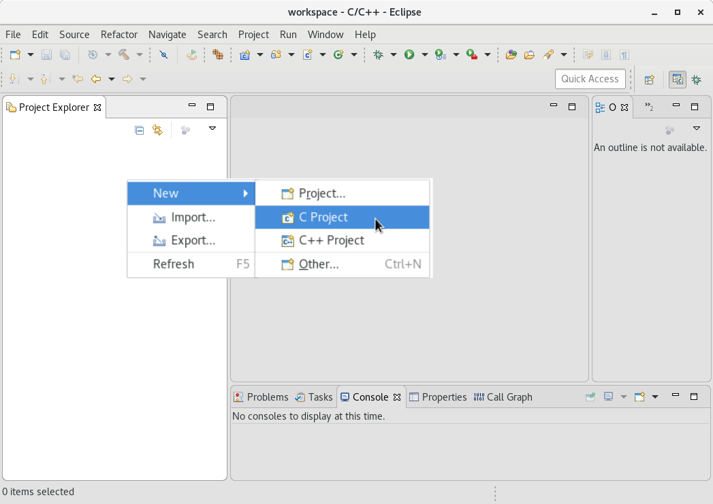

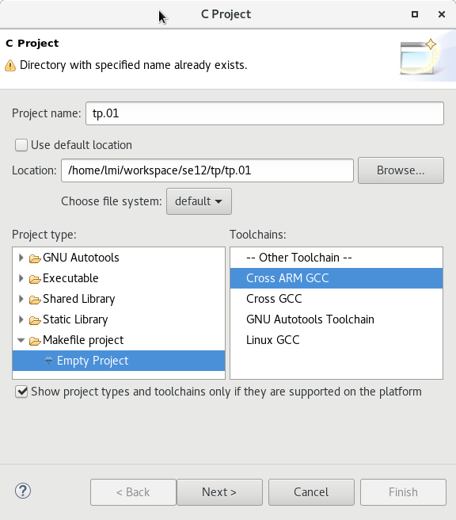

## Génération de l’application

Cliquer sur le marteau ou `Ctrl` + `b`

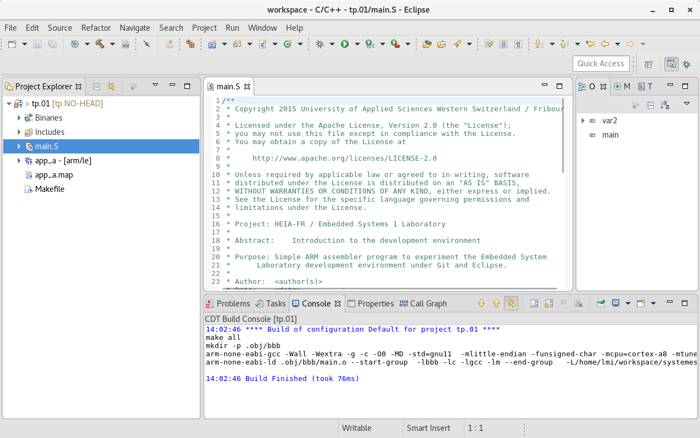


> **Attention**
> 
> il est important de contrôler qu’aucune erreur ne soit survenue
> durant la génération de votre application!

## Configuration du débogueur (I – main)

* Cliquer avec la flèche le petit insecte
* Choisir *« Debug Configurations »*
* Double-cliquer sur *« GDB SEGGER J-Link Debugging »*
* Choisir le projet *« tp.01 »* et l’application *« app_a »* et nommer *« tp.01 »*

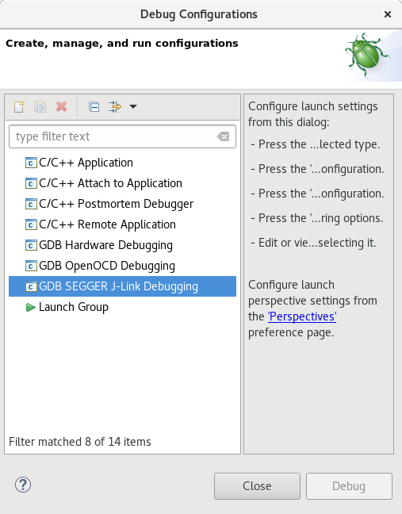

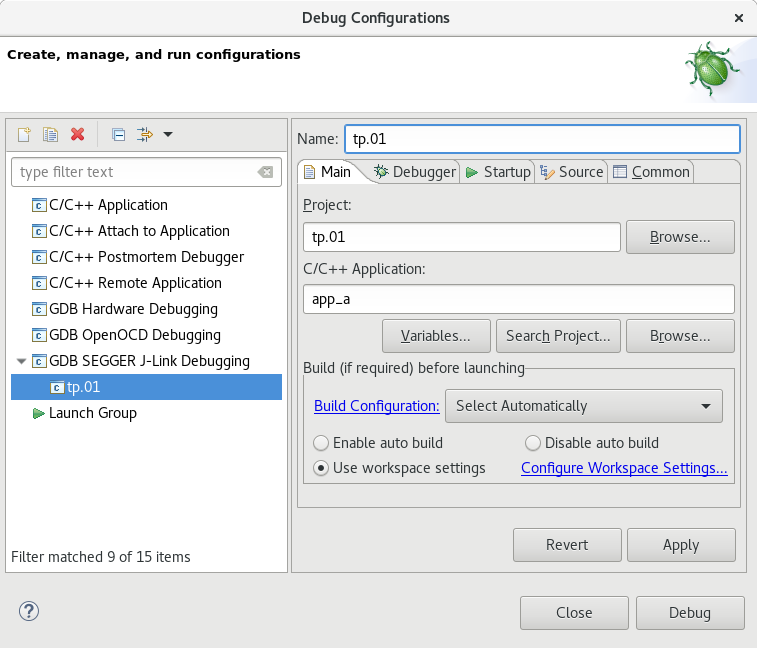

## Configuration du débogueur (II – Debugger)

* Ajouter dans *« Device name: »* *« am3358 »*
* Choisir dans *« Interface: »* *« JTAG »*
* Choisir dans *« Initial speed: »* *« Auto »*
* Décocher *« Allocate console for semihosting and SWO »*

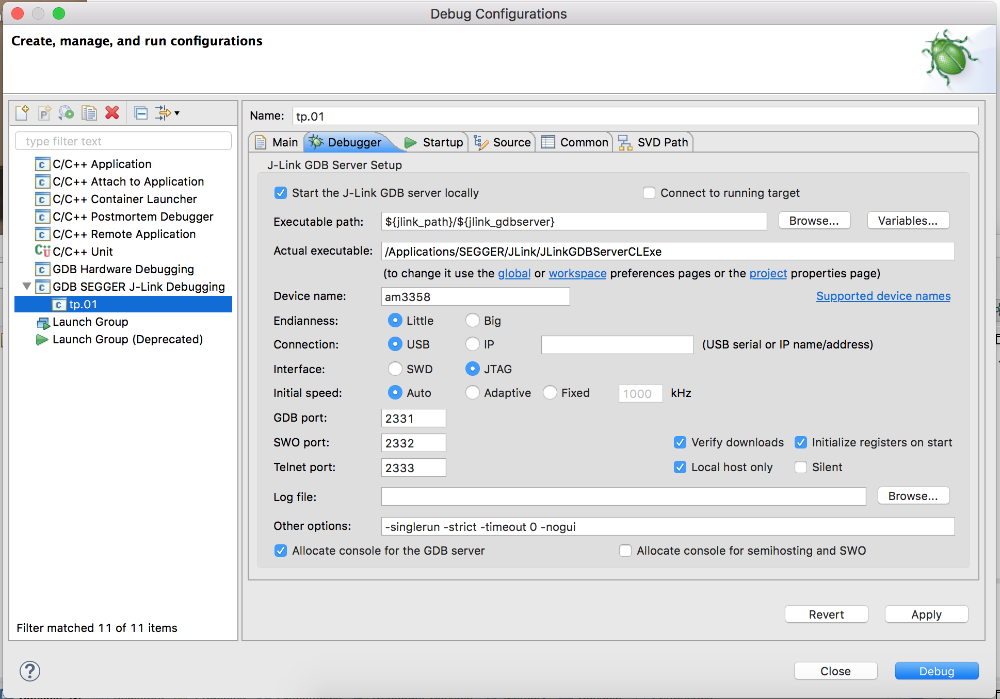

## Configuration du débogueur (III – Startup)

* Box "Initialization Commands"
    * Décocher *"Initial Reset..."*
    * Décocher *"Enable flash breakpoints."*
    * Décocher *"Enable semihosting..."*
    * *"JTAG/SWD Speed:"* choisir *"Auto"*
    * Introduire les commandes
      ```
      monitor reset
      monitor go
      monitor sleep 100
      monitor halt
      ```
* Box "Run/Restart Commands"
    * Décocher *"Pre-run/Restart reset"*

## Travail à réaliser

* Compilez l'application sous ./tp/tp.01 à l’aide de l’environnement de développement
* Exécutez l'application en mode « pas à pas » en l’ayant chargé préalablement sur la cible
* Adaptez le code
    * 1er étudiant : modifiez le code afin d'afficher le message "HEIA-Fr" au lieu de "HELLO"
    * 2ème étudiant : modifiez le code afin de ralentir la vitesse d'affichage du message
* Mettre ensemble les 2 modifications. Si nécessaire utilisez l'utilitaire "git mergetool".
* Répondez aux questions
* Rédigez votre journal de laboratoire
* Rendez votre code et votre journal au travers de Git

## Impératifs

* Le travail pratique doit être exécuté par chaque étudiant
* Le dépôt Git d'un groupe doit contenir le tag de chacun des membres du groupe
* A la fin du TP, le workspace sur la machine locale de chacun des membres du groupe doit
être synchronisé avec le dépôt Git commun au groupe

## Questions...

* Quelle est la taille de chacune des variables ?
* Quelle est la taille du code?
* Comment procéder pour obtenir ces tailles ?
* Où se trouve chaque variable en mémoire (adresse absolue) ?
* Où se trouve le code en mémoire ?
* Est-il possible d’améliorer / d'optimiser le code ? Si oui, comment ?
* Comment fonctionne de la macro `ARRAY_SIZE(x)`

## Journal

* Le travail effectué durant le laboratoire devra être résumé et synthétisé dans un journal
de laboratoire de 1 à 2 pages
    * En-tête
        * Etablissement: HEIA-FR (logo), institut, ...
        * Titre: Systèmes Embarqués I, journal, sujet (TP.01: Introduction)
        * Auteur (nom, email, classe, ...)
        * Lieu et date
    * Heures de travail en dehors des heures de classe pour ce TP
    * Synthèse de l'étudiant sur ce qu'il a appris/exercé durant le TP
        * Non acquis
        * Acquis, mais à exercer encore
        * Parfaitement acquis
    * Réponses aux questions
    * Remarques / choses à retenir
    * Feedback sur le TP
* Remarque
    * Le journal doit être rendu sous le format PDF.
    * Il peut être rédigé en français, allemand ou anglais.
    * Il doit être stocké dans le dépôt Git avec le code source sous
        * *sources: .../tp/tp.01*
        * *journal: .../tp/tp.01/doc/report.pdf*
* Délai
    * Le journal et le code doivent être rendus le soir même du TP au plus tard à 23h59

## Sauvegarde des sources dans le dépôt Git

Sauvegarder les modifications dans le dépôt local

* Ouvrir un terminal (une shell Linux)
* Consulter l’état du dépôt
  ```
  $ git status
  ```
* Ajouter éventuellement les nouveaux fichiers
  ```
  $ git add *
  ```
* Commiter les modifications
  ```
  git commit -a -m "un commentaire..."
  ```

Synchroniser le dépôt local avec les dépôts centralisés (serveurs)

* Synchroniser avec le dépôt du cours
  ```
  git pull upstream master
  ```
* Synchroniser avec le dépôt personnel
  ```
  $ git pull origin master
  ```

Sauvegarder le résultat du travail dans le dépôt centralisé (serveur)

* Pousser la branche sur le dépôt
  ```
  $ git push origin master
  ```
