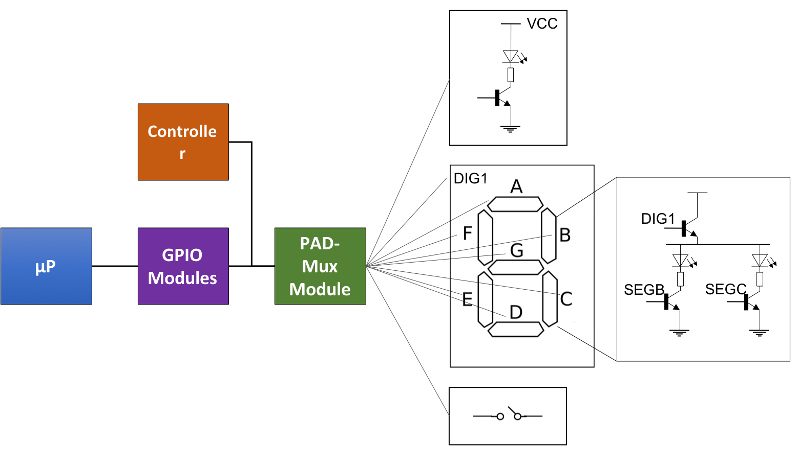

# TP.02 : Einführung in die modulare Programmierung in C 

## Ziele

Am Schluss des Labors sind die Studenten/Studentinnen fähig,

* Modulare Programme (mehrere Dateien) in C zu konzipieren und zu realisieren
* Ein C Programm zu debuggen
* Das Schema einer einfachen elektronischen Schaltung und dessen Inhalt zu verstehen, sowie die Ein-/Ausgänge zu identifizieren
* Entwerfen eines Programmes zur Steuerung des Drehencoders, Taster, LEDs und 7-Segmentanzeige
 des HEIA-FR-Erweiterungsmodules (Karte) des Beaglebone mit Hilfe der Ein-/Ausgangsports des µP

Dauer der praktischen Arbeit

* 2 Laboreinheiten (8 Stunden) + persönliche Arbeit

Abzugeben:

* Laborbericht und den Sourcecode auf das zentralisierte Depot

## Aufgaben

In diesem TP soll eine modulare Applikation in C konzipiert und realisiert werden,
welche Peripheriegeräte, wie digitiale Ein-/und Ausgänge, LEDs, Taster, 7-Segmentanzeigen
und Drehencoder verwendet.
Diese Applikation soll zwei Funktionen für die 7-Segmentanzeige bereitstellen, 
einen *Zähler* und eine *Spirale*.

Die Spezifikationen der Applikation:

* 7-Segmentanzeige
    * Funktion *Zähler*
        * Wert des Zählers anzeigen von -99 bis +99
		* Negative Werte werden durch das Aufleuchten des Punktes _DP1_ des linken Digits angezeigt
    * Funktion *Spirale*
		* Die Spirale soll beide Digits durchlaufen
        * Freie Wahl der Form der Spirale

* Drehencoder
    * *Zähler*
		* Rechts drehen inkrementiert den Zähler, der maximale
		Wert ist 99
		* Links drehen dekrementiert den Zähler, der minimale
		Wert ist -99
    * *Spirale*
		* Rechts drehen bewegt die Spirale vorwärts,
		Links drehen bewegt sie rückwärts

* Taster & LEDs
	* Drücken des Tasters S1 aktiviert die Funktion Zähler. Dies
	wird durch Aufleuchten der LED 1 angezeigt

	* Drücken des Tasters S2 aktiviert die Funktion Spirale. Dies
	wird durch Aufleuchten der LED 2 angezeigt

	* Drücken des Tasters S3 initialisiert die zwei Funktionen der Applikation.
	Solange der Taster S3 gedrückt wird, soll die LED 3 aufleuchten

## Material
Dieser TP wird hauptsächlich die Peripheriegeräte der Erweitungskarte verwenden.

### Erweitungskarte des BBB
Die folgende Abbildung stellt das Schema der Erweitungskarte des Beaglebone Blacks dar.

### Digitale Ein-/und Ausgänge (GPIO)
* Um die LEDs der 7-Segmentanzeige oder die Taster S1 zu steuern, besitzt der µP
Ein-/und Ausgangscontroller (GPIO)
* Die Multiplexer (PAD-MUX Modul) dienen als Schnittstelle für die
verschiedenen Controller des µP, den GPIO mit dessen physischen Ports.

* Das Modul _`am335x_gpio.h`_ der Bibliothek _`libbbb.a`_ stellt eine Reihe
von Diensten zur Verfügung, um die Ein-/und Ausgangsports zu steuern.

### Drehencoder
Der Encoder kennt nur 2 stabile Zustände, entweder die 2 Ports A und B auf 1 (on)
oder beide Ports auf 0 (off). 

## Fragen
* Könnte man auf Header-Dateien _(header-files)_ in C verzichten ?
	* Wenn ja, wie ?
	* Wenn nein, wieso ?

* _`#pragma once`_
	* Was ist der Nutzen dieses pragma in den Header-Dateien ?
	* Muss es durch eine andere Anweisung komplettiert werden ? Wenn ja, durch welche ?

* Was muss in einer Header-Datei stehen ?

* Was ist der Nutzen der Stichworte _`extern`_ und _`static`_ ?

* Wie muss man vorgehen, um eine Konstante in C zu definieren ?

* Was sind die Unterschiede zwischen den Instruktionen 
  _`#define MAX 10`_ und _`const int MAX=10;`_ ?

* Wie kann man eine Aufzählung in C definieren ? Was ist deren Nutzen ?

* Was sind die Unterschiede zwischen einer Struktur in C _`struct S{}`_ und einer Klasse in Java _`class C{}`_ ?

* Wie muss man vorgehen, um ein Array in C zu definieren ? Kann man diesem zum Zeitpunkt der Definition schon Initialwerte geben ?

* Wie muss man vorgehen, um die Anzahl der enthaltenen Elemente in einem Array zu erhalten ?

## Aktualisierungen

* Um die spezialisierte Bibliothek des Beaglebone zu aktualisieren
    
    `$ cd ~/workspace/se12/tp`
    
    `$ git pull upstream master`

* Um die Paths der includes in Eclipse zu aktualisieren
    
    * öffnen sie _`Properties`_ ihres Projektes
    * gehen sie in   _`C/C++ General`_ --> _`Paths and Symbols`_
    * öffnen sie _`Includes`_ --> _`GNU C`_
    * fügen sie _`/home/lmi/workspace/se12/tp/bbb/source`_ hinzu
    

## Bedingungen 
* Abgabe
    * Der Code und der Bericht werden auf das zentralisierte Git-Depot geladen
        * sources: _.../tp/tp.02_
        * Bericht: _.../tp/tp.02/doc/report.pdf_

* Frist
    * Der Code und der Bericht müssen bis spätestens 20 Tage nach dem TP bis 23h59 abgegeben werden.
