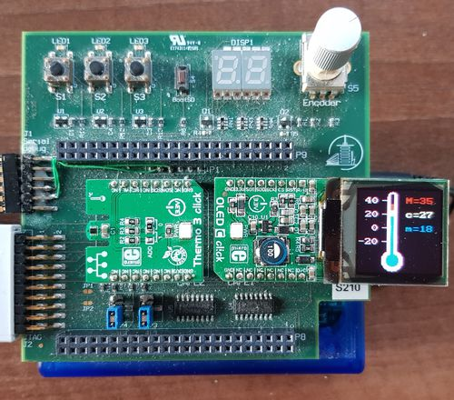

# TP.03 : Mise en oeuvre de périphériques avec C

## Objectifs

A la fin du laboratoire, les étudiant-e-s seront capables de

* Concevoir et réaliser un programme modulaire (plusieurs fichiers) en C
* Débugger un programme en C
* Décrire l'utilisation d'une ligne série UART
  (étude préliminaire des signaux et du protocole)
* Décrire les principes du bus série I2C
  (étude préliminaire des signaux et du protocole)
* Décrire les principes du bus série SPI 
  (étude préliminaire des signaux et du protocole)
* Concevoir une ligne de commande sur interface série UART
* Mettre en oeuvre d'un thermomètre sur bus I2C
* Mettre en oeuvre d'un écran LCD sur bus SPI
* Etudier le datasheet d'un composant électronique simple

Durée du travail pratique

* 2 séances de laboratoire (8 heures) + travail personnel

Rapport à rendre

* un journal de laboratoire avec le code source sur le dépôt centralisé

## Travail à réaliser

Ce TP a pour objectif la conception et réalisation d'une application modulaire
en C mettant en oeuvre des périphériques sur le bus I2C et SPI de la carte
d'extension, ainsi que la réalisation d'une ligne de commande utilisant
l'interface série du Beaglebone.

Les deux périphériques choisis sont le thermomètre Thermo3 connecté sur le
bus I2C ainsi que l'écran LCD OLED-C connecté sur le bus SPI. Ces périphériques
sont à insérer sur la carte d'extension dans le slot 1 (CAPE1) pour l'écran et
le slot 2 (CAPE2) pour le thermomètre.

L'application consistera à réaliser un thermomètre numérique avec affichage
de la température actuelle ainsi que les valeurs minimales et maximales
mesurées par le thermomètre (voir figure ci-dessous). La ligne de commande
permettra d'interagir avec l'application.



Voici les spécifications de l'application:

* Thermomètre
  * La température lue sur le thermomètre I2C sera convertie et affichée
    en degré Celcius.
  * Les températures minimales et maximales seront calculées en temps
    réels et affichées en degré Celcius.

* Affichage LCD
  * L'affichage LCD sera divisé en 2 parties
    * sur la partie de gauche de l'écran, on affichera les températures
      actuelles, minimales et maximales sur une représentation d'un
      thermomètre analogique gradué de -20 à +40°C.
    * sur la partie de droite de l'écran, on affichera les températures
      sous une forme textuelle (ascii).

  * Les 3 températures seront affichées avec des couleurs distinctes.

  * L'orientation de l'affichage sera telle que, lorsque l'on regarde l'écran
    LCD, il soit également possible de lire les textes inscrits sur le
    PCB de la carte, c.à.d. boutons poussoir, display 7-segment et encodeur
    rotatif situés en dessus des click boards.

* Ligne de commande (CLI)
  * Au minimum 2 commandes devront être implémentées, soit:
    * une commande permettant de choisir la couleur du thermomètre et les 
      couleurs des différentes températures à afficher. Une option devra
      permettre de choisir les couleurs par défaut.
    * une commande permettant au mininum d'initialiser les températures
      minimales et maximales à la valeur actuelle de la température.

## Aspects pratiques

Voici quelques points qui devraient faciliter la réalisation de ce
travail pratique.

### Ligne de commande

6 interfaces séries équipent le µP TI AM3358 du Beaglebone. Celles-ci
sont pilotées par le module _`am335x_uart`_ de la bibliothèque _`bbb`_. 
Le UART_0 sert d'interface console, interface série utilisée par les 
systèmes d'exploitation comme interface de commande texte.
  
Pour la réalisation de la ligne de commande, 3 bibliothèques sont
disponbiles l'acquisition des caractères tapés au clavier, soit :

* _`am335x_console`_ de la bibliothèque _`bbb`_ offre une interface de
  très bas niveau spécialement développée pour le Beaglebone.

* _`stdio`_ de la bibliothèque standard C _`glibc`_ offrent une interface
  très performante avec des méthodes tels que  _`printf`_, _`scanf`_,
  _`getchar`_, _`putchar`_ ou _`puts`_.

* la biblothèque _`fileio`_ tirée du monde _`Unix`_ offrent également des
  services _`read`_ et _`write`_ non-bloquants facilitant la réalisation
  du ligne de commande. Pour accéder la console, il faudra simplement 
  ouvrir le fichier virtuel _`/dev/console`_.

La bibliothèque _`getopt`_ permet de traiter très élégamment les arguments
de la ligne de commande.

### Thermomètre I2C

Le processeur dispose de 3 contrôlleurs I2C. Le 2e controlleur, bus I2C2,
permet d'interfacer le µP avec des périphériques _microBUS_ inserrés dans
les slots "CAPE1" et "CAPE2" de la carte d'extension.
Le module _`am335x_i2c`_ de la bibliothèque _`bbb`_ fournit les services
nécessaires au pilotage de tels périphériques.

La click board "Thermo3", périphérique I2C, permet en autre l'acquisition de
la température ambiante. Les détails techniques de ce thermomètre sont
disponibles dans les documents du cours ou directement sur Gitlab ([se12/docs/01_datasheets/03_i2c/04_tmp102](https://gitlab.forge.hefr.ch/se12-1819/se12/blob/master/docs/01_datasheets/03_i2c/04_tmp102.pdf)).

### Ecran LCD OLED

Le microprocesseur dispose également de 2 contrôlleurs SPI. Le bus SPI numéro 1
est aussi disponible sur les slots "CAPE1" et "CAPE2" de la carte d'extension.
Le module _`am335x_spi`_ de la bibliothèque _`bbb`_ fournit les services
nécessaires au pilotage de ces périphériques.

La click board "OLED-C", périphérique SPI, fournit un écran LCD de 96x96
pixels en RGB565. Les détails techniques de l'écran sont disponibles dans
les documents du cours ou directement sur Gitlab ([se12/docs/01_datasheets/04_oled](https://gitlab.forge.hefr.ch/se12-1819/se12/tree/master/docs/01_datasheets/04_oled)).
Le module _`oled`_ founit des services pour piloter cette carte.
Cependant, celle-ci doit impérativement être connectée sur la CAPE1.

La police _`font_8x8`_ offre un "bitmap" pour chacun des 256 caractères
du code ascii. Celle-ci peut bien natuellement être ajustée au besoin du
projet.


## Questions

* Quelles sont les caractéristiques principales (signaux et protocole) 
  des interfaces de communication UART, I2C et SPI ?

* Comment effectuer une rotation d'image avant d'être affichée sur un
  écran LCD ?

## Mises à jour

* Pour mettre à jour la bibliothèque spécialisée du Beaglebone

    ```
    $ cd ~/workspace/se12/tp
    $ git pull upstream master
    $ make -C ~/workspace/se12/tp/bbb/source
    ```

* Pour mettre à jour les paths des includes dans eclipse
  * ouvrir _`Properties`_ de votre projet
  * aller   _`C/C++ General`_  --> _`Paths and Symbols`_
  * ouvrir _`Includes`_ --> _`GNU C`_
  * ajouter _`/home/lmi/workspace/se12/tp/bbb/source`_

## Conditions

* Rendu
  * Le code et le rapport seront rendus au travers du dépôt Git centralisé
    * sources: _.../tp/tp.03_
    * rapport: _.../tp/tp.03/doc/report.pdf_

* Delai
  * Le journal et le code doivent être rendus au plus tard 20 jours après
    le TP à 23h59
