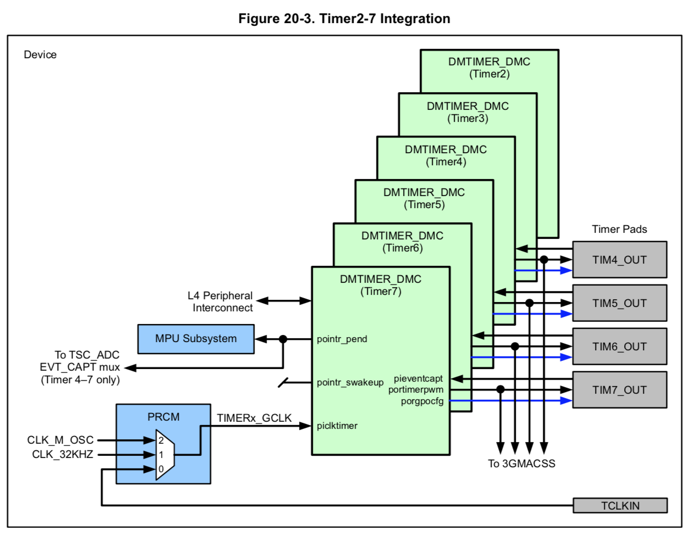
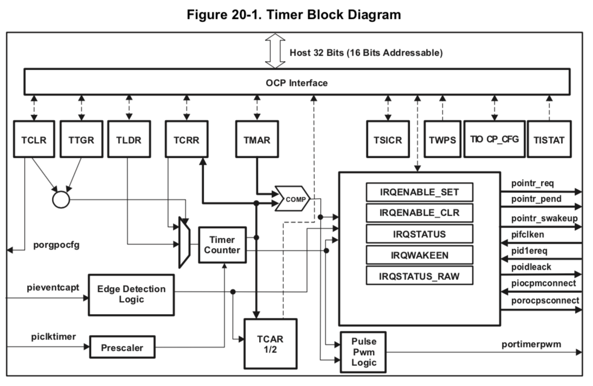
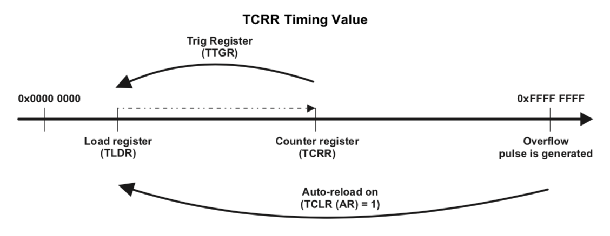
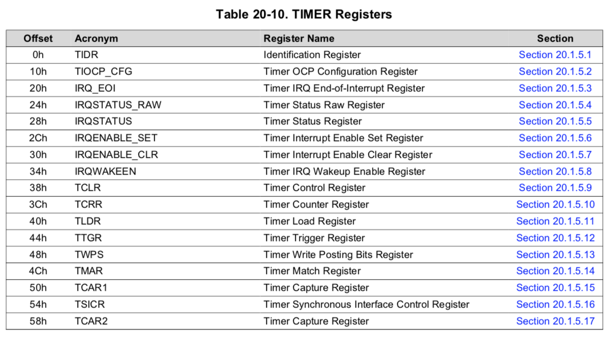

# TP.04 : Mise en oeuvre d'un timer hardware en C

## Objectifs

A la fin du laboratoire, les étudiant-e-s seront capables de

* Concevoir et réaliser un programme modulaire (plusieurs fichiers) en C
* Débugger un programme en C
* Concevoir et réaliser un pilote de périphérique en C
* Concevoir le pilote pour le contrôleur DMTimer du µP AM3358
* Intégrer des composants développés lors de travaux précédents
* Etudier le datasheet d'un composant d'un microprocesseur

Durée du travail pratique

* 1 séance de laboratoire (4 heures) + travail personnel

Rapport à rendre

* un journal de laboratoire avec le code source sur le dépôt centralisé

## Travail à réaliser

Ce TP a pour objectif la conception et réalisation d'un jeu permettant de
mesurer le temps de réaction d'une personne lors de l'apparition d'un signal
lumineux.

Pour la réalisation de cette application, il faudra mettre en oeuvre un bouton
poussoir, l'écran LCD OLED-C ainsi qu'un timer du µP TI AM3358.

Spécifications de l'application

* Amorce
  * Une pression sur un bouton poussoir permettra d'armer le jeu
  * Un message s'affichera sur l'écran LCD indiquant que le jeu démarre

* Réflexe
  * Après un temps aléatoire entre 500 et 2500 ms, un nouveau message
    s'affichera sur l'écran LCD
  * Un premier compteur prendra la valeur courante d'un timer du µP
  * Dès la relâche du bouton poussoir, un 2e compteur prendra la nouvelle
    valeur du timer
  * La différence entre ces 2 compteurs donnera le temps de réaction

* Résultat
  * Le temps de réaction devra être affiché en ms sur l'écran LCD
  * Une nouvelle pression sur le bouton poussoir réamorcera le jeu


Horloge

  * Le timer DMTimer2 du µP AM3358 servira d'horloge pour l'application

  * Le pilote de périphérique permettra de contrôler les 6 timers du µP,
    DMTimer 2 à 7, et offrira les services suivants
    * Méthode pour initialiser un timer
    * Méthode pour lire la valeur actuelle d'un timer
    * Méthode pour lire la fréquence à laquelle un timer est cadencé

  * Le bon fonctionnement du pilote devra être validé

## Aspects pratiques

Voici quelques points qui devraient faciliter la réalisation de ce
travail pratique.

### Les timers du µP AM3358
Le µP dispose de 8 timers distincts (DMTimer 0 à 7). Les timers 2 à 7 sont
identiques. La figure "integration" ci-dessous montre leur intégration sur
le µP TI AM3358.

Comme indiqué sur la figure "integration", les timers reçoivent leur horloge
du module _PRCM_. Ce module propose 3 horloges différentes, soit une horloge
_CLK_M_OSC_ à 24MHz, une horloge _CLK_32KHz_ et une horloge externe.
Le module _`<am335x_clock.h>`_ fournit les services nécessaires pour enclencher
les horloges des différents contrôleurs du µP. La méthode
_`am335x_clock_enable_timer_module(enum am335x_clock_timer_modules module)`_
permettra de sélectionner l'horloge _CLK_M_OSC_ et ainsi de cadencer le timer
spécifié lors de l'appel de la méthode.



([ref: se12/docs/01_datasheets/01_am335x/06_am335x_technical_reference_manual.pdf, page 4328](https://gitlab.forge.hefr.ch/se12-1819/se12/blob/master/docs/01_datasheets/01_am335x/06_am335x_technical_reference_manual.pdf))


### Le schéma fonctionnel des DMTimer 2 à 7
La figure "dmtimer" ci-dessous montre le schéma fonctionnel des DMTimer 2 à 7
du µP AM3358. Seule la fonction _counter_ avec auto-reload sera nécessaire à la
réalisation de ce projet, soit les blocs _Prescaler_ et _Timer Counter_, ainsi
que les registres _tclr_, _ttgr_, _tldr_, _tcrr_ et _tiocp_cfg_. La logique
d'interruption ne sera, quant à elle, pas utile au projet.



([ref: se12/docs/01_datasheets/01_am335x/06_am335x_technical_reference_manual.pdf, page 4326](https://gitlab.forge.hefr.ch/se12-1819/se12/blob/master/docs/01_datasheets/01_am335x/06_am335x_technical_reference_manual.pdf))

### Le mode compteur du DMTimer

La figure "mode compteur" ci-dessous montre le mode _compteur_ des DMTimer.
Dans ce mode, le timer incrémente le contenu du registre _tccr_ à la
fréquence de l'horloge (dans note cas à 24MHz), jusqu'à la valeur d'overflow
0xffff'ffff avant de s'arrêter.

Si l'on configure le registre _tclr_ avec le bit _AR_  à 1, le contrôleur
rechargera le registre _tccr_ avec la valeur du registre _tldr_. Ce mode de
fonctionnement permet d'obtenir un timer qui compte indéfiniment sur une
période d'environ 3 minutes.



([ref: se12/docs/01_datasheets/01_am335x/06_am335x_technical_reference_manual.pdf, chapitre 20.1.3.1, page 4331](https://gitlab.forge.hefr.ch/se12-1819/se12/blob/master/docs/01_datasheets/01_am335x/06_am335x_technical_reference_manual.pdf))

### Les registres des DMTimer 2 à 7

La figure "registers" ci-dessous montre les registres des DMTimers 2 à 7.

Ces registres sont placés dans l'espace adressable du µP aux adresses suivantes (voir pages 181-182)

 * DMTimer2 : `0x4804_0000 - 0x4804_0FFF`
 * DMTimer3 : `0x4804_2000 - 0x4804_2FFF`
 * DMTimer4 : `0x4804_4000 - 0x4804_4FFF`
 * DMTimer5 : `0x4804_6000 - 0x4804_6FFF`
 * DMTimer6 : `0x4804_8000 - 0x4804_8FFF`
 * DMTimer7 : `0x4804_A000 - 0x4804_AFFF`



([ref: se12/docs/01_datasheets/01_am335x/06_am335x_technical_reference_manual.pdf, page 4340](https://gitlab.forge.hefr.ch/se12-1819/se12/blob/master/docs/01_datasheets/01_am335x/06_am335x_technical_reference_manual.pdf))

## Questions

* Quelle est la signification du qualificatif _`volatile`_ et quelle est son
  utilité quand il est associé à un pointeur ?
* Comment sont placés les champs (membres) d’une structure dans la mémoire ?
* Comment peut-on efficacement définir les registres d’un contrôleur de
  périphérique situés dans l’espace d’adressage du µP ainsi que leur
  contenu en C ?
* Comment peut-on accéder ces registres ?
* Comment générer des nombres aléatoires ?
* A la fréquence maximale (24MHz), le compteur du timer ne permet de compter
  le temps que sur un intervalle de 3 minutes environ. Décrivez l'algorithme
  à mettre en place si l'on souhaite compter sur plusieurs années avec la
  même granularité.

## Mises à jour

* Pour mettre à jour la bibliothèque spécialisée du Beaglebone

    ```
    $ cd ~/workspace/se12/tp
    $ git pull upstream master
    $ make -C ~/workspace/se12/tp/bbb/source
    ```

* Pour mettre à jour les paths des includes dans eclipse
  * ouvrir _`Properties`_ de votre projet
  * aller   _`C/C++ General`_  --> _`Paths and Symbols`_
  * ouvrir _`Includes`_ --> _`GNU C`_
  * ajouter _`/home/lmi/workspace/se12/tp/bbb/source`_

## Conditions

* Rendu
  * Le code et le rapport seront rendus au travers du dépôt Git centralisé
    * sources: _.../tp/tp.04_
    * rapport: _.../tp/tp.04/doc/report.pdf_

* Délai
  * Le journal et le code doivent être rendus au plus tard 7 jours après
    le TP à 23h59
