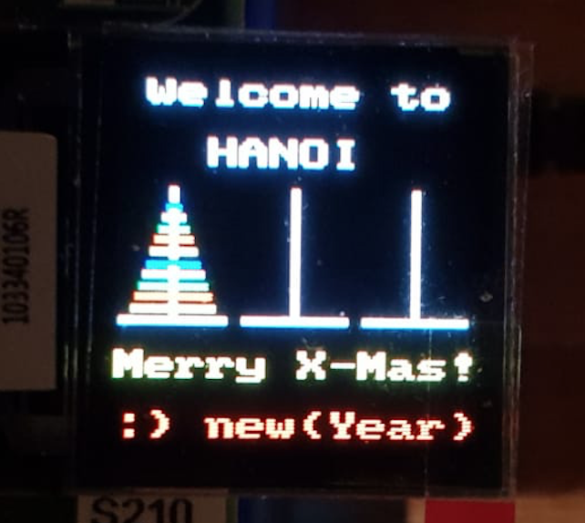

# TP.05 : Introduction au langage assembleur et interface avec le C

## Objectifs

A la fin du laboratoire, les étudiant-e-s seront capables de

* Concevoir et réaliser un programme en langage assembleur
* Interfacer des fonctions assembleur avec des fonctions en C
* Débugger un programme mixte assembleur et C
* Intégrer des composants développés lors de travaux précédents

Durée du travail pratique

* 2 séances de laboratoire (8 heures) + travail personnel

Rapport à rendre

* un journal de laboratoire avec le code source sur le dépôt centralisé

## Travail à réaliser

Ce TP a pour objectif la conception et réalisation en langage assembleur
du jeu de la tour de hanoi sur l'écran LCD OLED de notre cible Beaglebone.



La tour sera constituée de 10 disques de couleurs différentes. On choisira
le déplacement de la tour avec une pression sur le bouton poussoir
correspondant à la cheville souhaitée.


## Aspects pratiques

Voici quelques points qui devraient faciliter la réalisation de ce
travail pratique.

### Quelques services utiles à développer pour la réalisation du jeu

Voici quelques fonctions qui seraient intéressantes de réaliser afin de
faciliter le développement de l'application.

```c
/**
 * method to clear the disk located at position "height" out of the given "peg"
 */
static void clear_disk(int peg, int height);

/**
 * method to draw a "disk" on given "peg" at the specified position "height"
 */
static void draw_disk(int peg, int height, int disk);

/**
 * method to push a "disk" onto the given "peg"
 */
static void push_disk(int peg, int disk);

/**
 * method to move a "disk" out of specified peg "from" to another one "to"
 */
static void move_disk(int from, int to, int disk);

/**
 * method to draw a peg
 */
static void draw_peg(int peg);
```

Voici la fonction coeur de la tour de hanoi

```c
void tower_of_hanoi_move(int from, int to, int by, int height)
{
	if (height > 0) {
		height--;
		tower_of_hanoi_move(from, by, to, height);
		move_disk(from, to, height);
		tower_of_hanoi_move(by, to, from, height);
	}
}
```

Pour obtenir la mise image sur l'écran LCD que celui de la figure ci-dessus, il suffit d'implémenter la méthode suivante:

```c
void tower_of_hanoi_init(int peg)
{
	display_init();

	for (int i = NUMBER_OF_PEGS-1; i>=0; i--) {
		draw_peg(i);
	}

	for (int i = TOWER_HEIGHT-1; i >= 0; i--) {
		push_disk(peg, i);
	}

	display_text(0, 0, " Welcome to ", DISPLAY_WHITE);
	display_text(0, 2, "   HANOI    ", DISPLAY_WHITE);

	display_text(0, 9, "Merry X-Mas!", DISPLAY_YELLOW);
	display_text(0,11, ":) new(Year)", DISPLAY_RED);
}
```

## Questions

* Pour les deux structures _`struct S1`_ et _`struct S2`_ et le code ci-dessous,

	```c
	struct S1 {int a;};
	struct S2 {int a; int b[100];};

	struct S1 f1();
	struct S2 f2();

	void f3 (int a, int b, int c, int d, struct S2 s);
	void f4 (int a, int b, int c, int d, const struct S2* s);
	void f5 (struct S2 s, int a, int b, int c, int d);
	void f6 (const struct S2* s, int a, int b, int c, int d);
	void f7 (struct S1 s);
	```

  indiquez la convention utilisée pour

  * le retour de ces structures par les fonctions _`f1`_ et _`f2`_
  * le passage par valeur de ces structures par les fonctions _`f3`_ à _`f7`_


## Mises à jour

* Pour mettre à jour la bibliothèque spécialisée du Beaglebone

    ```
    $ cd ~/workspace/se12/tp
    $ git pull upstream master
    $ make -C ~/workspace/se12/tp/bbb/source
    ```

* Pour mettre à jour les paths des includes dans eclipse
  * ouvrir _`Properties`_ de votre projet
  * aller   _`C/C++ General`_  --> _`Paths and Symbols`_
  * ouvrir _`Includes`_ --> _`GNU C`_
  * ajouter _`/home/lmi/workspace/se12/tp/bbb/source`_

## Conditions

* Rendu
  * Le code et le rapport seront rendus au travers du dépôt Git centralisé
    * sources: _.../tp/tp.05_
    * rapport: _.../tp/tp.05/doc/report.pdf_

* Délai
  * Le journal et le code doivent être rendus au plus tard 7 jours après
    le dernier TP à 23h59
