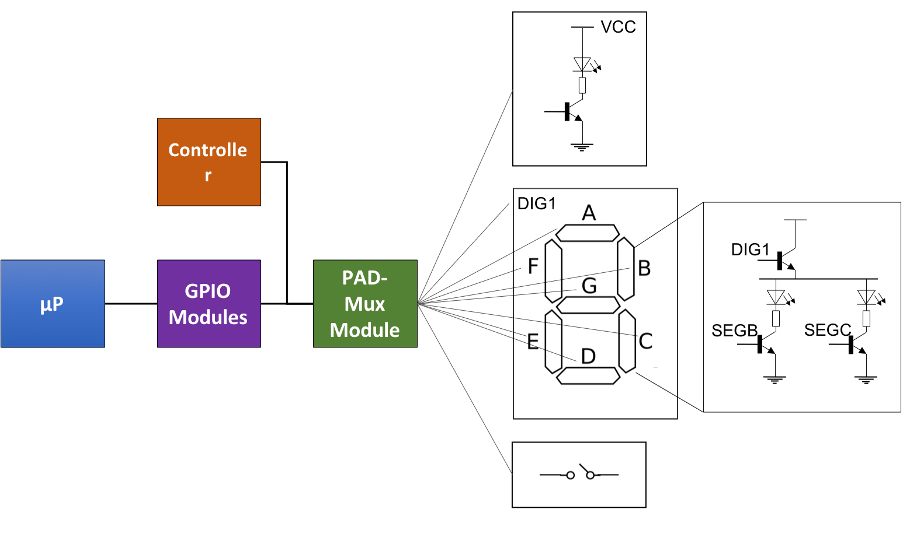

# TP.02 : Introduction à la programmation modulaire en C 

## Objectifs

A la fin du laboratoire, les étudiant-e-s seront capables de

* Concevoir et réaliser un programme modulaire (plusieurs fichiers) en C
* Débugger un programme en C
* Etudier un schéma élémentaire d’un circuit électronique, en comprendre 
  son contenu et identifier les portes d'entrée/sortie
* Concevoir un programme capable de piloter l'encodeur rotatif, les boutons 
  poussoir, les LEDs et l'afficheur 7-segment de la carte d'extension HEIA-FR
  du Beaglebone par l'intermédiaire des ports d'entrée/sortie du µP

Durée du travail pratique

* 2 séances de laboratoire (8 heures) + travail personnel 

Rapport à rendre

* un journal de laboratoire avec le code source sur le dépôt centralisé

## Travail à réaliser

Ce TP vise à concevoir et réaliser une application modulaire en C mettant 
en oeuvre des périphériques d'entrée/sortie digitale, soit les LEDs, les 
boutons-poussoirs, l'affichage 7-segment et l'encodeur rotatif. Cette 
application devra offrir sur son affichage 7-segment deux fonctions, un 
 *compteur* et un *serpentin*.

Voici les spécifications de l'application:

* Affichage 7-segment
    * Fonction *Compteur*
        * affichage de la valeur du compteur de -99 à +99
        * les valeurs négatives seront indiquées avec le point _DP1_ du digit de gauche allumé
    * Fonction *Serpentin*
        * le serpentin devra traverser les 2 digits
        * toute liberté sur la forme du serpentin 

* Encodeur rotatif
    * *Compteur*
        * des rotations vers la droite incrémentent le compteur, la valeur 
          maximale est 99
        * des rotations vers la gauche décrémentent le compteur la valeur 
          minimale est -99
    * *Serpentin*
        * des rotations sur la droite ou la gauche feront avancer ou reculer 
          le serpentin

* Boutons-poussoirs & LEDs
    * une pression sur le bouton S1 activera la fonction compteur. Son 
      activation sera indiquée en allumant la LED 1

    * une pression sur le bouton S2 activera la fonction serpentin. Son 
      activation sera indiquée en allumant la LED 2

    * une pression sur le bouton S3 initialisera les deux fonctions de 
      l'application. Tant que le bouton S3 sera pressé, la LED 3 devra 
      être allumée

## Infrastructure matérielle
Ce travail pratique va utiliser principalement les périphériques de la carte d'extension.

### Carte d'extension du BBB
Le figure ci-dessous présente le schéma de la carte d'extension du Beaglebone Black.

### Entrée/sortie digitale (GPIO)
* Pour piloter les LEDs du display 7-segment ou les boutons-poussoirs S1, le µP
  dispose de contrôleurs d'entrée/sortie (GPIO)
* Les multiplexeurs (PAD-Mux Module) servent à interfacer les différents 
  contrôleurs du µP, dont les contrôleurs GPIO, avec ses portes physiques

* Le module _`am335x_gpio.h`_ de la bibliothèque _`libbbb.a`_ offre une série 
  de services pour piloter les portes d'entrée/sortie

### Encodeur rotatif
L'encodeur ne connait que 2 états stables, soit les 2 ports A et B à 1 (on), soit les 2 ports à 0 (off). 

## Questions
* Pourrait-on se passer des fichiers d'entête _(header files)_ en C ? 
    * Si oui, comment ? 
    * Si non, pour quelle raison ?

* _`#pragma once`_
    * Quelle est l'utilité de ce pragma dans les fichiers d'entête ? 
    * Doit-il être accompagné d'une autre directive ? Si oui, laquelle ?

* Que faut-il placer dans un fichier d'entête ?

* Quelle est l'utilité des mots-clef _`extern`_ et _`static`_ ?

* Comment faut-il procéder pour définir une constante en C ?

* Quelle(s) différence(s) existe-t-il entre les instructions 
  _`#define MAX 10`_ et _`const int MAX=10;`_ ?

* Comment peut-on définir une énumération en C ? Quelle est son utilité ?

* Quelle(s) différence(s) existe-t-il entre une structure en C _`struct S{}`_ 
  et une classe en Java _`class C{}`_ ?

* Comment faut-il procéder pour définir un tableau en C ? Peut-on lui donner 
  des valeurs initiales lors de sa définition ?

* Comment faut-il procéder pour obtenir le nombre d'éléments contenus dans 
  un tableau ?

## Mises à jour

* Pour mettre à jour la bibliothèque spécialisée du Beaglebone
    
    `$ cd ~/workspace/se12/tp`
    
    `$ git pull upstream master`

* Pour mettre à jour les paths des includes dans eclipse
    
    * ouvrir _`Properties`_ de votre projet
    * aller   _`C/C++ General`_  --> _`Paths and Symbols`_
    * ouvrir _`Includes`_ --> _`GNU C`_
    * ajouter _`/home/lmi/workspace/se12/bbb/source`_
    

## Conditions 
* Rendu
    * Le code et le rapport seront rendus au travers du dépôt Git centralisé
        * sources: _.../tp/tp.02_
        * rapport: _.../tp/tp.02/doc/report.pdf_

* Delai
    * Le journal et le code doivent être rendus au plus tard 13 jours après le TP à 23h59
